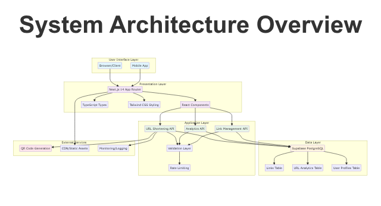
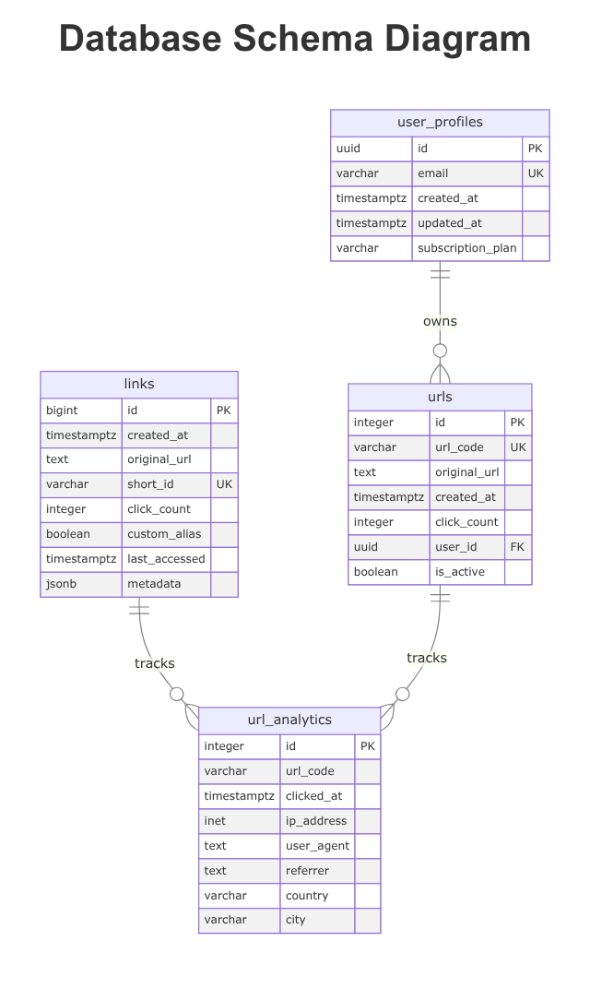
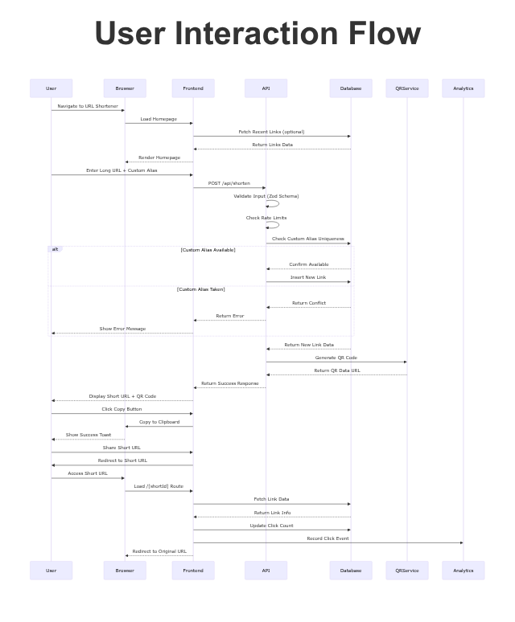
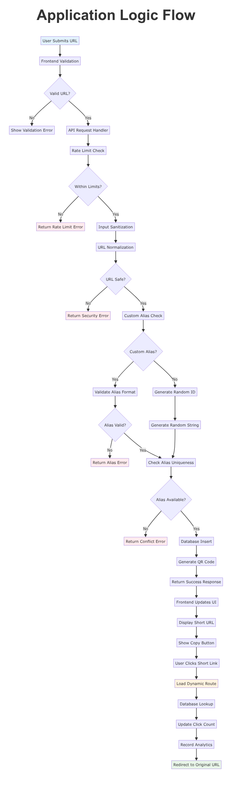

# URL Shortener - Project Architecture Document

**Document Version:** 1.0  
**Last Updated:** 2025-11-06  
**Author:** MiniMax Agent  
**Project URL:** https://abbbu0qutf0o.space.minimax.io (Enhanced Version)  
**Repository:** Local Development Environment  

---

## 📋 Table of Contents

1. [Executive Summary](#executive-summary)
2. [Application Architecture](#application-architecture)
3. [File Hierarchy & Component Analysis](#file-hierarchy--component-analysis)
4. [Data Architecture](#data-architecture)
5. [API Architecture](#api-architecture)
6. [User Interaction Flow](#user-interaction-flow)
7. [Application Logic Flow](#application-logic-flow)
8. [Security Architecture](#security-architecture)
9. [Deployment Architecture](#deployment-architecture)
10. [Development Setup](#development-setup)
11. [Performance Considerations](#performance-considerations)
12. [Testing Strategy](#testing-strategy)
13. [Future Considerations](#future-considerations)

---

## 🚀 Executive Summary

### Project Overview

The URL Shortener is a production-ready, full-stack web application built with modern technologies to provide fast, secure, and feature-rich URL shortening capabilities. The application combines intuitive user experience with robust backend infrastructure to deliver enterprise-grade link management and analytics.

### Business Value

- **Instant URL Transformation**: Convert long, complex URLs into short, memorable links
- **Comprehensive Analytics**: Track click-through rates, geographic data, and user behavior
- **QR Code Generation**: Automatic QR code creation for mobile-friendly sharing
- **No Registration Required**: Zero-friction user experience for immediate productivity
- **Scalable Architecture**: Built to handle high-traffic scenarios with optimal performance

### Technology Stack

| Layer | Technology | Purpose | Justification |
|-------|------------|---------|---------------|
| **Frontend** | Next.js 14 (App Router) | React Framework | Modern React features, SEO optimization, server-side rendering |
| **Language** | TypeScript 5.0 | Type Safety | Developer productivity, runtime error prevention |
| **Styling** | Tailwind CSS 3.3 | Utility-First CSS | Rapid development, consistent design system |
| **Component Library** | Radix UI | Accessible Components | WCAG compliance, keyboard navigation |
| **Database** | Supabase PostgreSQL | Backend-as-a-Service | Real-time capabilities, built-in authentication |
| **Forms** | React Hook Form + Zod | Form Management | Performance, schema validation |
| **Charts** | Chart.js + React-Chartjs-2 | Data Visualization | Interactive analytics dashboards |
| **QR Codes** | qrcode.react | QR Generation | Client-side rendering, no external dependencies |
| **Testing** | Vitest + Testing Library | Test Framework | Fast, reliable, modern testing experience |
| **Containerization** | Docker + Docker Compose | Deployment | Consistent environments, easy scaling |

### Key Features

✅ **Smart URL Shortening**: Auto-generate or custom alias creation  
✅ **Real-time Analytics**: Click tracking with visual dashboards  
✅ **QR Code Integration**: Automatic QR code generation  
✅ **Responsive Design**: Mobile-first, cross-device compatibility  
✅ **Rate Limiting**: IP-based abuse prevention  
✅ **Input Validation**: Comprehensive security measures  
✅ **Type Safety**: 100% TypeScript coverage  
✅ **Performance Optimized**: Next.js optimization features  

---

## 🏗️ Application Architecture

### System Architecture Overview



The application follows a modern **JAMstack (JavaScript, APIs, Markup)** architecture with server-side rendering capabilities provided by Next.js. The system is designed for high performance, scalability, and maintainability.

### Architecture Principles

1. **Separation of Concerns**: Clear boundaries between UI, business logic, and data layers
2. **Component-Based Design**: Reusable React components with consistent interfaces
3. **Type Safety**: End-to-end TypeScript coverage for error prevention
4. **Performance First**: Optimized bundle sizes and loading strategies
5. **Security by Design**: Input validation, rate limiting, and sanitization throughout
6. **Developer Experience**: Modern tooling, hot reloading, and comprehensive testing

### Technology Decisions

**Next.js 14 with App Router**: Chosen for its superior SEO capabilities, automatic code splitting, and built-in optimization features. The App Router provides better performance and developer experience compared to traditional page routing.

**Supabase Integration**: Selected for its PostgreSQL foundation, real-time capabilities, and built-in authentication system. Provides both SQL flexibility and NoSQL-like ease of use.

**TypeScript Throughout**: Ensures type safety from database to UI, reducing runtime errors and improving developer productivity through intelligent IDE support.

---

## 📁 File Hierarchy & Component Analysis

### Complete Project Structure

```
url-shortener/
├── 📁 app/                          # Next.js 14 App Router
│   ├── 📄 layout.tsx                # Root layout with providers
│   ├── 📄 page.tsx                  # Homepage component
│   ├── 📄 not-found.tsx             # 404 error page
│   ├── 📄 globals.css               # Global styles
│   ├── 📁 [shortId]/                # Dynamic route for redirects
│   │   └── 📄 page.tsx              # Link redirect handler
│   ├── 📁 analytics/                # Analytics dashboard
│   │   └── 📄 page.tsx              # Analytics interface
│   └── 📁 api/                      # API routes
│       ├── 📁 shorten/              # URL shortening endpoint
│       │   └── 📄 route.ts          # POST /api/shorten
│       ├── 📁 links/                # Link management
│       │   └── 📄 route.ts          # GET /api/links
│       ├── 📁 analytics/            # Analytics data
│       │   └── 📄 route.ts          # GET /api/analytics
│       └── 📁 delete/               # Link deletion
│           └── 📄 route.ts          # DELETE /api/links/delete
├── 📁 components/                   # React components
│   ├── 📄 url-form.tsx              # URL shortening form
│   ├── 📄 link-table.tsx            # Link management table
│   ├── 📄 analytics.tsx             # Analytics dashboard
│   ├── 📄 analytics-chart.tsx       # Chart components
│   ├── 📄 qr-code.tsx               # QR code display
│   └── 📁 ui/                       # Reusable UI components
│       ├── 📄 button.tsx            # Button component
│       ├── 📄 card.tsx              # Card container
│       ├── 📄 input.tsx             # Form input
│       ├── 📄 table.tsx             # Data table
│       ├── 📄 toast.tsx             # Notification system
│       └── 📄 toaster.tsx           # Toast provider
├── 📁 lib/                          # Utility libraries
│   ├── 📄 supabase.ts               # Supabase client configuration
│   ├── 📄 utils.ts                  # Helper functions
│   ├── 📄 rateLimiter.ts            # Rate limiting logic
│   └── 📄 constants.ts              # Application constants
├── 📁 types/                        # TypeScript definitions
│   └── 📄 database.ts               # Database type definitions
├── 📁 hooks/                        # Custom React hooks
│   └── 📄 use-toast.ts              # Toast notification hook
├── 📁 tests/                        # Test files
│   ├── 📁 api/                      # API endpoint tests
│   ├── 📁 lib/                      # Utility function tests
│   └── 📄 setup.ts                  # Test configuration
├── 📁 scripts/                      # Deployment scripts
│   └── 📄 db-init.sql               # Database initialization
├── 📄 package.json                  # Dependencies and scripts
├── 📄 next.config.mjs               # Next.js configuration
├── 📄 tailwind.config.ts            # Tailwind CSS configuration
├── 📄 tsconfig.json                 # TypeScript configuration
├── 📄 Dockerfile                    # Docker containerization
├── 📄 docker-compose.yml            # Docker orchestration
└── 📄 database_schema_backup.sql    # Database backup script
```

### Key Component Breakdown

#### `/app` Directory (App Router)

**layout.tsx**: The root layout component that wraps all pages. Provides:
- Global metadata and SEO configuration
- Font loading (Inter typeface)
- Navigation header and footer
- Toast notification system
- Analytics tracking integration

**page.tsx**: The homepage component featuring:
- Hero section with value proposition
- URL shortening form integration
- Recent links display
- Quick stats dashboard
- Feature highlights
- How-it-works explanation

**/[shortId]/page.tsx**: Dynamic route handling URL redirects:
- Extracts short ID from URL parameters
- Looks up original URL in database
- Updates click count and analytics
- Performs redirect with proper HTTP status codes
- Error handling for invalid/inactive links

**/api/shorten/route.ts**: Core URL shortening endpoint:
- Input validation with Zod schemas
- Rate limiting based on IP address
- URL sanitization and normalization
- Custom alias validation and uniqueness checking
- QR code generation with error handling
- Comprehensive error responses

#### `/components` Directory

**url-form.tsx**: Primary form component for URL shortening:
- React Hook Form integration with Zod validation
- Real-time URL validation
- Custom alias input with format checking
- Loading states and error handling
- Success feedback with copy-to-clipboard
- QR code display after successful creation

**link-table.tsx**: Data table for link management:
- Server-side pagination and sorting
- Responsive design for mobile devices
- Copy-to-clipboard functionality
- Delete operations with confirmation
- Analytics data integration
- Empty state handling

**analytics.tsx**: Dashboard component for link statistics:
- Real-time data visualization
- Chart.js integration for interactive graphs
- Click tracking and geographic data
- Performance metrics display
- Export functionality

#### `/lib` Directory

**supabase.ts**: Database client configuration:
- Multiple client instances (anon, service role, auth)
- Type-safe database operations
- Connection pooling and error handling
- Environment variable validation

**utils.ts**: Utility functions library:
- URL validation and sanitization
- Secure ID generation
- Date/time formatting
- String manipulation helpers
- Error handling utilities

**rateLimiter.ts**: Rate limiting implementation:
- IP-based request tracking
- Configurable time windows
- Memory-efficient storage
- Graceful degradation

### Configuration Files

**next.config.mjs**: Next.js configuration featuring:
- TypeScript and ESLint build ignores
- External package configuration
- Image optimization settings
- Environment variable mapping

**tailwind.config.ts**: Styling configuration:
- Custom color palette
- Typography settings
- Component class definitions
- Responsive breakpoints

**tsconfig.json**: TypeScript configuration:
- Strict mode enabled
- Path mapping for clean imports
- Modern ECMAScript target
- Comprehensive type checking

---

## 🗄️ Data Architecture

### Database Schema Overview



The application uses a normalized PostgreSQL database managed by Supabase, designed for optimal performance and data integrity.

### Core Tables

#### `links` Table (Primary URL Storage)

```sql
CREATE TABLE public.links (
    id bigint PRIMARY KEY DEFAULT nextval('links_id_seq'),
    created_at timestamptz DEFAULT now(),
    original_url text NOT NULL,
    short_id varchar UNIQUE NOT NULL,
    click_count integer DEFAULT 0,
    custom_alias boolean DEFAULT false,
    last_accessed timestamptz,
    metadata jsonb DEFAULT '{}'
);
```

**Design Rationale**:
- `bigint` for `id` to support high-scale growth
- `short_id` as VARCHAR with unique constraint for fast lookups
- `metadata` as JSONB for flexible additional data storage
- `custom_alias` boolean for tracking alias type
- Automatic timestamping for audit trails

#### `url_analytics` Table (Click Tracking)

```sql
CREATE TABLE public.url_analytics (
    id integer PRIMARY KEY DEFAULT nextval('url_analytics_id_seq'),
    url_code varchar NOT NULL,
    clicked_at timestamptz DEFAULT now(),
    ip_address inet,
    user_agent text,
    referrer text,
    country varchar,
    city varchar
);
```

**Design Rationale**:
- `inet` type for IP address storage and querying
- `user_agent` parsing for device detection
- Geographic data for location-based analytics
- Comprehensive click event tracking

#### `urls` Table (Legacy Support)

```sql
CREATE TABLE public.urls (
    id integer PRIMARY KEY DEFAULT nextval('urls_id_seq'),
    url_code varchar UNIQUE NOT NULL,
    original_url text NOT NULL,
    created_at timestamptz DEFAULT now(),
    click_count integer DEFAULT 0,
    user_id uuid,
    is_active boolean DEFAULT true
);
```

**Design Rationale**:
- Maintains backward compatibility
- `user_id` for future authentication features
- `is_active` for soft deletion and link management

#### `user_profiles` Table (Future Authentication)

```sql
CREATE TABLE public.user_profiles (
    id uuid PRIMARY KEY DEFAULT gen_random_uuid(),
    email varchar UNIQUE NOT NULL,
    created_at timestamptz DEFAULT now(),
    updated_at timestamptz DEFAULT now(),
    subscription_plan varchar DEFAULT 'free'
);
```

**Design Rationale**:
- UUID primary keys for distributed system compatibility
- Email-based user identification
- Subscription plan tracking for monetization
- Automatic timestamp updates via triggers

### Database Relationships

- **links → url_analytics**: One-to-many relationship for click tracking
- **urls → url_analytics**: One-to-many relationship for legacy analytics
- **user_profiles → urls**: One-to-many relationship for user ownership (future)

### Performance Optimizations

**Indexes Created**:
- `idx_links_short_id`: Unique index for O(1) lookups
- `idx_links_created_at`: Date-based queries optimization
- `idx_links_click_count`: Analytics sorting optimization
- `idx_urls_url_code`: Legacy URL lookups
- `user_profiles_email_key`: User authentication optimization

**Query Optimization**:
- Prepared statements for all database operations
- Connection pooling through Supabase
- Efficient JOINs for analytics queries
- Pagination for large result sets

---

## 🔌 API Architecture

### API Design Principles

The API follows RESTful conventions with comprehensive error handling, rate limiting, and input validation. All endpoints return consistent JSON responses with appropriate HTTP status codes.

### Core Endpoints

#### 1. URL Shortening (`POST /api/shorten`)

**Purpose**: Create shortened URLs with optional custom aliases

**Request Schema**:
```typescript
{
  url: string;           // Required: Full URL to shorten
  customAlias?: string;  // Optional: 4-10 character alphanumeric alias
}
```

**Response Schema**:
```typescript
{
  shortId: string;       // Generated or custom short ID
  shortUrl: string;      // Complete shortened URL
  qrDataUrl?: string;    // Base64 encoded QR code (optional)
  originalUrl: string;   // Sanitized original URL
  customAlias: boolean;  // Whether custom alias was used
  createdAt: string;     // ISO 8601 timestamp
  message: string;       // Success message
}
```

**Error Responses**:
- `400`: Validation errors (invalid URL, malformed alias)
- `409`: Conflict (custom alias already exists)
- `429`: Rate limit exceeded
- `500`: Internal server error

**Implementation Details**:
- Zod schema validation for request body
- IP-based rate limiting (5 requests/minute default)
- URL sanitization and normalization
- Unique ID generation with collision detection
- QR code generation with error handling
- Comprehensive logging for debugging

#### 2. Link Management (`GET /api/links`)

**Purpose**: Retrieve user's shortened links with pagination

**Query Parameters**:
```
?page=1&limit=10&sort=created_at&order=desc
```

**Response Schema**:
```typescript
{
  data: Link[];
  pagination: {
    page: number;
    limit: number;
    total: number;
    totalPages: number;
  };
}
```

#### 3. Analytics Data (`GET /api/analytics`)

**Purpose**: Provide comprehensive link analytics

**Response Schema**:
```typescript
{
  totalLinks: number;
  totalClicks: number;
  topLinks: Array<{
    shortId: string;
    originalUrl: string;
    clickCount: number;
    createdAt: string;
  }>;
  clicksLast7Days: Array<{
    date: string;
    count: number;
  }>;
}
```

#### 4. Link Deletion (`DELETE /api/links/delete`)

**Purpose**: Remove shortened links

**Request Schema**:
```typescript
{
  shortId: string;
}
```

### Error Handling Strategy

**HTTP Status Codes**:
- `200`: Success
- `201`: Created (new resource)
- `400`: Bad Request (validation errors)
- `404`: Not Found (resource doesn't exist)
- `409`: Conflict (resource already exists)
- `429`: Too Many Requests (rate limit)
- `500`: Internal Server Error

**Error Response Format**:
```typescript
{
  error: string;
  code: string;
  details?: any;
  message?: string;
}
```

**Error Codes**:
- `VALIDATION_ERROR`: Input validation failure
- `CONFLICT`: Resource already exists
- `NOT_FOUND`: Resource not found
- `RATE_LIMIT`: Rate limit exceeded
- `ERROR`: Generic server error

### Rate Limiting Implementation

**Algorithm**: Sliding window rate limiting with IP tracking

**Configuration**:
- Default: 5 requests per minute per IP
- Burst tolerance: 10 requests
- Reset window: 60 seconds

**Implementation**:
```typescript
interface RateLimitResult {
  allowed: boolean;
  remaining: number;
  resetTime: number;
  limit: number;
}
```

---

## 👤 User Interaction Flow



### Primary User Journeys

#### Journey 1: URL Shortening

1. **Landing**: User arrives at homepage via direct URL or referral
2. **Form Interaction**: User enters long URL and optionally custom alias
3. **Validation**: Frontend performs real-time URL validation
4. **Submission**: Form submits to `/api/shorten` endpoint
5. **Processing**: Server validates input, checks rate limits, processes request
6. **Response**: API returns short URL, QR code, and metadata
7. **Display**: Frontend shows success state with copy functionality
8. **Sharing**: User can share the short URL via multiple channels

#### Journey 2: Link Management

1. **Access**: User views homepage with recent links section
2. **Navigation**: User clicks "Analytics" or views link table
3. **Data Loading**: System fetches user's links and analytics data
4. **Interaction**: User can copy links, view analytics, or delete links
5. **Updates**: Changes are immediately reflected in the interface

#### Journey 3: Analytics Viewing

1. **Navigation**: User navigates to analytics dashboard
2. **Data Fetching**: System loads comprehensive analytics data
3. **Visualization**: Charts and graphs display click trends
4. **Exploration**: User can drill down into specific link performance
5. **Export**: User can export analytics data for external analysis

### Mobile Responsiveness Flow

- **Breakpoint Detection**: Tailwind CSS responsive utilities
- **Touch Optimization**: Larger touch targets for mobile devices
- **Form Adaptation**: Stack layout for smaller screens
- **Table Responsiveness**: Horizontal scroll and card layouts
- **Performance**: Optimized for mobile network conditions

### Error State Handling

- **Network Errors**: Retry mechanisms and offline indicators
- **Validation Errors**: Real-time feedback with clear messages
- **Server Errors**: Graceful degradation with helpful messages
- **Rate Limiting**: Clear communication of limits and reset times

---

## ⚙️ Application Logic Flow



### Core Processing Flows

#### URL Shortening Logic

1. **Input Validation**:
   - URL format validation using regex patterns
   - Protocol checking (http/https only)
   - Custom alias format validation (alphanumeric, 4-10 chars)
   - Sanitization to prevent XSS attacks

2. **Rate Limiting Check**:
   - Extract client IP from request headers
   - Check against in-memory rate limit store
   - Return 429 status if limit exceeded
   - Track requests per IP address

3. **ID Generation**:
   - For custom aliases: validate format and uniqueness
   - For auto-generated: use cryptographically secure random generation
   - Collision detection with database lookup
   - Retry logic with exponential backoff

4. **Database Operations**:
   - Insert new link record with metadata
   - Transaction safety for data consistency
   - Error handling for constraint violations
   - Return created record with full details

5. **QR Code Generation**:
   - Generate QR code for short URL
   - Configurable error correction level
   - Base64 encoding for direct embedding
   - Graceful handling of generation failures

#### Analytics Tracking Logic

1. **Click Detection**:
   - Intercept short URL access
   - Extract short ID from URL parameters
   - Validate short ID format
   - Lookup original URL in database

2. **Data Collection**:
   - Capture visitor IP address
   - Parse user agent for device info
   - Extract referrer information
   - Timestamp click event

3. **Database Update**:
   - Increment click count in links table
   - Insert detailed record in analytics table
   - Update last_accessed timestamp
   - Handle concurrent updates safely

4. **Redirect Processing**:
   - Validate original URL safety
   - Perform HTTP 301 redirect
   - Log redirect event
   - Handle invalid or inactive links

### Error Handling Strategy

#### Validation Errors
- Input sanitization prevents injection attacks
- Zod schemas catch type mismatches
- Clear error messages guide user corrections
- Consistent error format across API

#### System Errors
- Database connection failures trigger retries
- Rate limiting prevents service abuse
- QR generation failures don't block URL creation
- Comprehensive logging for debugging

#### Recovery Mechanisms
- Automatic retry for transient failures
- Circuit breaker pattern for external services
- Graceful degradation for non-critical features
- Health checks for system monitoring

---

## 🔒 Security Architecture

### Security Design Principles

1. **Defense in Depth**: Multiple layers of security controls
2. **Input Validation**: All inputs validated and sanitized
3. **Principle of Least Privilege**: Minimal required permissions
4. **Secure by Default**: Security features enabled by default
5. **Fail Securely**: Errors don't leak sensitive information

### Authentication & Authorization

**Current State**: No authentication required (anonymous usage)

**Future Enhancement**: Supabase Auth integration planned
- Email/password authentication
- Social login providers
- JWT token management
- Row-level security policies

### Input Validation

#### URL Validation
```typescript
const isValidUrl = (url: string): boolean => {
  try {
    const parsedUrl = new URL(url);
    return ['http:', 'https:'].includes(parsedUrl.protocol);
  } catch {
    return false;
  }
};
```

**Validation Rules**:
- Must be valid HTTP/HTTPS URL
- No javascript: or data: protocols allowed
- Maximum URL length: 2048 characters
- IP addresses allowed for http/https only

#### Custom Alias Validation
```typescript
const isValidAlias = (alias: string): boolean => {
  return /^[a-zA-Z0-9]{4,10}$/.test(alias);
};
```

**Validation Rules**:
- Alphanumeric characters only
- Minimum length: 4 characters
- Maximum length: 10 characters
- No reserved words or conflicts

### Rate Limiting Implementation

**Algorithm**: Sliding window rate limiting

**Configuration**:
- 5 requests per minute per IP address
- Burst allowance: 10 requests
- Reset period: 60 seconds

**Implementation Details**:
```typescript
interface RateLimitEntry {
  count: number;
  resetTime: number;
}

const rateLimitStore = new Map<string, RateLimitEntry>();
```

**Benefits**:
- Prevents API abuse
- Protects against DDoS attacks
- Ensures fair resource allocation
- Configurable thresholds

### SQL Injection Prevention

**Strategy**: Parameterized queries only

**Implementation**:
- All database queries use Supabase prepared statements
- No string concatenation for SQL queries
- Type-safe queries with TypeScript
- Automatic parameter binding

**Example**:
```typescript
const { data } = await supabase
  .from('links')
  .select('*')
  .eq('short_id', shortId);
```

### XSS Protection

**Measures**:
- React's built-in XSS protection
- Input sanitization for user-generated content
- Content Security Policy headers
- No innerHTML usage without sanitization

### Data Privacy

**Collected Data**:
- IP addresses for rate limiting and analytics
- User agents for device detection
- Referrer information for traffic analysis

**Privacy Measures**:
- Data retention policies
- IP address anonymization options
- GDPR compliance considerations
- No personal information collection

### Security Headers

**Implemented Headers**:
- `X-Content-Type-Options`: nosniff
- `X-Frame-Options`: DENY
- `X-XSS-Protection`: 1; mode=block
- `Referrer-Policy`: strict-origin-when-cross-origin

---

## 🚢 Deployment Architecture

### Containerization Strategy

The application uses Docker for consistent deployment across environments with multi-stage builds for optimal image size and security.

#### Dockerfile Architecture

```dockerfile
# Multi-stage build for optimization
FROM node:22-alpine AS base
FROM base AS deps          # Dependencies stage
FROM base AS builder       # Build stage  
FROM base AS runner        # Production stage
```

**Build Optimization**:
- Separate dependency installation from application code
- Node.js 22 Alpine for minimal image size
- Production-only dependencies in final stage
- Security-focused base image

#### Docker Compose Setup

**Services Defined**:
- **app**: Next.js application (port 3000)
- **database**: Supabase PostgreSQL (port 5432)
- **adminer**: Database management (port 8080)

**Configuration Features**:
- Environment variable management
- Volume persistence for data
- Health checks for reliability
- Network isolation between services

### Production Deployment

#### Environment Configuration

**Required Environment Variables**:
```bash
NEXT_PUBLIC_SUPABASE_URL=https://project.supabase.co
NEXT_PUBLIC_SUPABASE_ANON_KEY=your_anon_key
SUPABASE_SERVICE_ROLE_KEY=your_service_role_key
NEXT_PUBLIC_BASE_URL=https://yourdomain.com
```

**Security Considerations**:
- Service role key never exposed to client
- Environment variables validated at startup
- Secrets management through Docker secrets
- HTTPS enforcement in production

#### Deployment Platforms

**Primary Platform**: Custom hosting with Docker support

**Alternative Platforms**:
- **Vercel**: Next.js optimized deployment
- **Railway**: Simple container deployment
- **DigitalOcean App Platform**: Managed containers
- **AWS ECS/EKS**: Enterprise container orchestration

### Performance Optimizations

#### Build Optimizations
- **Next.js Bundle Analysis**: Webpack bundle analyzer
- **Code Splitting**: Automatic route-based splitting
- **Tree Shaking**: Dead code elimination
- **Image Optimization**: Next.js Image component

#### Runtime Optimizations
- **CDN Integration**: Static asset distribution
- **Database Connection Pooling**: Supabase managed
- **Caching Strategy**: Redis integration planned
- **Compression**: Gzip/Brotli compression enabled

### Monitoring & Observability

**Application Monitoring**:
- Error tracking with structured logging
- Performance metrics collection
- Database query monitoring
- API response time tracking

**Infrastructure Monitoring**:
- Container health checks
- Resource usage monitoring
- Uptime monitoring
- Log aggregation and analysis

### Scalability Considerations

**Horizontal Scaling**:
- Stateless application design
- Load balancer compatible
- Database read replicas
- CDN for static assets

**Vertical Scaling**:
- CPU and memory optimization
- Database performance tuning
- Connection pool sizing
- Resource allocation planning

---

## 🛠️ Development Setup

### Prerequisites

**Required Software**:
- Node.js 18.17.0 or higher
- npm 8.0.0 or higher (or yarn/pnpm)
- Git for version control
- Docker (optional, for containerized development)

**Recommended Tools**:
- VS Code with TypeScript extensions
- Supabase CLI for local development
- Docker Desktop for container management

### Local Development Setup

#### 1. Repository Setup

```bash
# Clone the repository
git clone <repository-url>
cd url-shortener

# Install dependencies
npm install

# Copy environment template
cp .env.local.example .env.local
```

#### 2. Environment Configuration

**Required Environment Variables**:
```env
# Supabase Configuration
NEXT_PUBLIC_SUPABASE_URL=your_supabase_project_url
NEXT_PUBLIC_SUPABASE_ANON_KEY=your_supabase_anon_key
SUPABASE_SERVICE_ROLE_KEY=your_supabase_service_role_key

# Application Configuration
NEXT_PUBLIC_BASE_URL=http://localhost:3000
RATE_LIMIT_PER_MINUTE=5

# Optional: Development settings
NODE_ENV=development
NEXT_TELEMETRY_DISABLED=1
```

#### 3. Database Setup

**Option A: Supabase Cloud (Recommended)**
1. Create account at [supabase.com](https://supabase.com)
2. Create new project
3. Run database initialization script:
   ```bash
   psql -h your-host -U postgres -d postgres -f scripts/db-init.sql
   ```

**Option B: Local PostgreSQL**
1. Install PostgreSQL locally
2. Create database:
   ```bash
   createdb url_shortener_dev
   ```
3. Import schema:
   ```bash
   psql -d url_shortener_dev -f database_schema_backup.sql
   ```

#### 4. Development Server

```bash
# Start development server
npm run dev

# Application will be available at http://localhost:3000
```

### Docker Development

#### Using Docker Compose

```bash
# Start all services
docker-compose up --build

# View logs
docker-compose logs -f app

# Execute commands in containers
docker-compose exec app sh
docker-compose exec database psql -U postgres
```

### Code Quality Tools

#### TypeScript Configuration

**tsconfig.json Highlights**:
```json
{
  "compilerOptions": {
    "strict": true,
    "noUncheckedIndexedAccess": true,
    "exactOptionalPropertyTypes": true
  }
}
```

**Benefits**:
- Runtime error prevention
- Enhanced IDE support
- Self-documenting code
- Refactoring safety

#### ESLint & Prettier

**Configuration Features**:
- TypeScript-aware linting
- React Hooks rules
- Import organization
- Code formatting automation

**Usage**:
```bash
# Lint code
npm run lint

# Fix linting issues
npm run lint:fix

# Format code
npm run format

# Type checking
npm run typecheck
```

#### Git Hooks (Husky)

**Pre-commit Hooks**:
- TypeScript type checking
- ESLint validation
- Prettier formatting
- Test execution

**Configuration**:
```json
{
  "lint-staged": {
    "*.{js,jsx,ts,tsx}": [
      "eslint --fix",
      "prettier --write"
    ]
  }
}
```

### IDE Configuration

#### VS Code Extensions

**Recommended Extensions**:
- TypeScript and JavaScript Language Features
- Tailwind CSS IntelliSense
- Prettier - Code formatter
- ESLint
- GitLens
- Auto Rename Tag
- Bracket Pair Colorizer

#### VS Code Settings

```json
{
  "editor.formatOnSave": true,
  "editor.codeActionsOnSave": {
    "source.fixAll.eslint": true
  },
  "typescript.preferences.importModuleSpecifier": "relative"
}
```

### Debugging Configuration

#### VS Code Debug Configuration

```json
{
  "version": "0.2.0",
  "configurations": [
    {
      "name": "Debug Next.js",
      "type": "node",
      "request": "launch",
      "program": "${workspaceFolder}/node_modules/.bin/next",
      "args": ["dev"],
      "env": {
        "NODE_OPTIONS": "--inspect"
      }
    }
  ]
}
```

### Environment-Specific Configuration

#### Development
- Hot reloading enabled
- Source maps for debugging
- Detailed error messages
- API request logging

#### Staging
- Production-like environment
- Performance monitoring
- Error tracking enabled
- Database seeding for testing

#### Production
- Optimized builds
- Error monitoring
- Performance analytics
- Security headers enabled

---

## ⚡ Performance Considerations

### Frontend Performance

#### Bundle Optimization

**Next.js Optimizations**:
- **Automatic Code Splitting**: Route-based code splitting
- **Tree Shaking**: Unused code elimination
- **Dynamic Imports**: Lazy loading of components
- **Image Optimization**: Next.js Image component

**Bundle Analysis**:
```bash
# Analyze bundle size
npm run build
npx @next/bundle-analyzer
```

**Performance Metrics**:
- Initial bundle size: < 100KB gzipped
- Route-based chunks: < 30KB each
- Third-party dependencies: < 50KB total

#### Caching Strategy

**Static Assets**:
- CDN caching for images and fonts
- Browser caching headers
- Service worker for offline capability

**API Responses**:
- Database query result caching
- Redis integration for frequently accessed data
- Cache invalidation strategies

#### Critical Rendering Path

**Optimization Techniques**:
- Preload critical resources
- Minimize render-blocking CSS
- Optimize font loading
- Lazy load non-critical components

### Backend Performance

#### Database Optimization

**Query Performance**:
- Proper indexing on frequently queried columns
- Query plan analysis and optimization
- Connection pooling through Supabase
- Batch operations for bulk data

**Database Indexes**:
```sql
-- Primary performance indexes
CREATE INDEX idx_links_short_id ON links(short_id);
CREATE INDEX idx_analytics_url_code ON url_analytics(url_code);
CREATE INDEX idx_links_created_at ON links(created_at);
```

#### API Performance

**Response Optimization**:
- Response compression (gzip/brutli)
- JSON serialization optimization
- Pagination for large datasets
- Selective field loading

**Rate Limiting Impact**:
- Minimal performance overhead
- In-memory storage for speed
- Configurable thresholds
- Graceful degradation

### Scalability Planning

#### Horizontal Scaling

**Application Layer**:
- Stateless design for easy scaling
- Load balancer compatibility
- Container orchestration ready
- Microservices migration path

**Database Layer**:
- Read replicas for scaling reads
- Connection pooling optimization
- Query optimization for high load
- Data partitioning strategies

#### Performance Monitoring

**Metrics to Track**:
- API response times
- Database query performance
- Memory and CPU usage
- Error rates and types

**Monitoring Tools**:
- Application Performance Monitoring (APM)
- Database performance insights
- Real User Monitoring (RUM)
- Synthetic monitoring

### Performance Best Practices

#### Development Guidelines

1. **Component Optimization**:
   - Use React.memo for expensive components
   - Implement proper key props for lists
   - Avoid unnecessary re-renders
   - Optimize image loading

2. **Data Fetching**:
   - Use SWR or React Query for caching
   - Implement proper loading states
   - Optimize database queries
   - Use pagination for large datasets

3. **Bundle Management**:
   - Regular bundle size analysis
   - Dependency audit and updates
   - Code splitting implementation
   - Tree shaking optimization

#### Production Optimization

1. **Deployment Optimization**:
   - CDN configuration
   - Gzip/Brotli compression
   - HTTP/2 enablement
   - Resource hints (preload, prefetch)

2. **Database Optimization**:
   - Query performance monitoring
   - Index optimization
   - Connection pool tuning
   - Read replica implementation

---

## 🧪 Testing Strategy

### Testing Philosophy

The testing strategy follows the **Testing Pyramid** approach with a strong emphasis on unit tests, integration tests, and minimal end-to-end tests for critical user journeys.

### Test Structure

#### Unit Tests (70% of tests)

**Coverage Areas**:
- Utility functions (`/lib/utils.ts`)
- Validation logic (Zod schemas)
- Helper functions
- Component logic without DOM interactions

**Testing Framework**: Vitest
```typescript
// Example unit test
import { describe, it, expect } from 'vitest';
import { isValidUrl, sanitizeUrl } from '@/lib/utils';

describe('URL Validation', () => {
  it('should validate correct HTTP URLs', () => {
    expect(isValidUrl('https://example.com')).toBe(true);
    expect(isValidUrl('http://test.org')).toBe(true);
  });

  it('should reject invalid protocols', () => {
    expect(isValidUrl('javascript:alert(1)')).toBe(false);
    expect(isValidUrl('data:text/html')).toBe(false);
  });
});
```

#### Integration Tests (25% of tests)

**Coverage Areas**:
- API endpoints with test database
- Database operations
- Component interactions
- Form submissions and validations

**Example Integration Test**:
```typescript
import { test, expect } from 'vitest';
import { createMocks } from 'node-mocks-http';
import handler from '@/app/api/shorten/route';

test('POST /api/shorten creates short URL', async () => {
  const { req, res } = createMocks({
    method: 'POST',
    body: {
      url: 'https://example.com/very/long/url'
    }
  });

  await handler(req, res);

  expect(res._getStatusCode()).toBe(201);
  const data = JSON.parse(res._getData());
  expect(data.shortId).toBeDefined();
  expect(data.shortUrl).toBeDefined();
});
```

#### End-to-End Tests (5% of tests)

**Coverage Areas**:
- Critical user journeys
- Browser compatibility
- Performance scenarios
- Error handling flows

**Testing Framework**: Playwright
```typescript
import { test, expect } from '@playwright/test';

test('URL shortening flow', async ({ page }) => {
  await page.goto('/');
  
  // Fill form
  await page.fill('[data-testid=url-input]', 'https://example.com');
  await page.click('[data-testid=shorten-button]');
  
  // Verify result
  await expect(page.locator('[data-testid=short-url]')).toBeVisible();
  const shortUrl = await page.textContent('[data-testid=short-url]');
  expect(shortUrl).toMatch(/^https?:\/\/.*\/[a-zA-Z0-9]{6}$/);
});
```

### Test Configuration

#### Vitest Configuration

```typescript
// vitest.config.ts
import { defineConfig } from 'vitest/config';

export default defineConfig({
  test: {
    environment: 'jsdom',
    setupFiles: ['./tests/setup.ts'],
    coverage: {
      reporter: ['text', 'json', 'html'],
      threshold: {
        global: {
          branches: 80,
          functions: 80,
          lines: 80,
          statements: 80
        }
      }
    }
  }
});
```

#### Test Utilities

**Database Testing**:
```typescript
// tests/helpers/database.ts
import { createClient } from '@supabase/supabase-js';
import { Database } from '@/types/database';

export const createTestDatabase = () => {
  const supabase = createClient<Database>(
    process.env.SUPABASE_TEST_URL!,
    process.env.SUPABASE_TEST_KEY!
  );
  
  return {
    async setup() {
      // Setup test data
    },
    async teardown() {
      // Clean up test data
    }
  };
};
```

**Mock Utilities**:
```typescript
// tests/helpers/mocks.ts
import { vi } from 'vitest';

export const mockSupabase = {
  from: vi.fn(() => ({
    select: vi.fn().mockReturnThis(),
    insert: vi.fn().mockReturnThis(),
    update: vi.fn().mockReturnThis(),
    delete: vi.fn().mockReturnThis(),
    eq: vi.fn().mockReturnThis(),
    single: vi.fn(),
    then: vi.fn()
  }))
};
```

### Code Coverage

#### Coverage Goals

**Target Coverage**:
- **Lines**: 80% minimum
- **Functions**: 80% minimum  
- **Branches**: 80% minimum
- **Statements**: 80% minimum

**Coverage Reporting**:
```bash
# Generate coverage report
npm run test:coverage

# View HTML report
open coverage/index.html
```

#### Coverage Exclusions

**Excluded from Coverage**:
- Type definitions and interfaces
- Test utilities and helpers
- Third-party library wrappers
- Configuration files

### Test Data Management

#### Database Seeding

**Test Data Setup**:
```typescript
// tests/fixtures/testData.ts
export const testLinks = [
  {
    short_id: 'test123',
    original_url: 'https://example.com',
    click_count: 5,
    custom_alias: false
  }
];

export const testAnalytics = [
  {
    url_code: 'test123',
    ip_address: '192.168.1.1',
    clicked_at: new Date().toISOString()
  }
];
```

### Continuous Integration

#### GitHub Actions Workflow

```yaml
# .github/workflows/test.yml
name: Tests
on: [push, pull_request]

jobs:
  test:
    runs-on: ubuntu-latest
    steps:
      - uses: actions/checkout@v3
      - uses: actions/setup-node@v3
        with:
          node-version: '18'
      - run: npm ci
      - run: npm run test:coverage
      - uses: codecov/codecov-action@v3
```

### Testing Best Practices

#### Component Testing

1. **Test User Interactions**:
   - Form submissions
   - Button clicks
   - Navigation flows

2. **Test Edge Cases**:
   - Empty states
   - Error conditions
   - Loading states

3. **Test Accessibility**:
   - Keyboard navigation
   - Screen reader compatibility
   - Focus management

#### API Testing

1. **Test All HTTP Methods**:
   - GET, POST, PUT, DELETE
   - Success and error responses
   - Status code validation

2. **Test Authentication**:
   - Public endpoints
   - Protected endpoints (future)
   - Rate limiting

3. **Test Validation**:
   - Input validation
   - Business logic validation
   - Error message accuracy

### Performance Testing

#### Load Testing

**Tools**: Artillery.js or k6
- API endpoint stress testing
- Database performance under load
- Memory usage monitoring
- Response time analysis

**Test Scenarios**:
- Normal usage patterns
- Peak traffic simulation
- Rate limit enforcement
- Database connection limits

---

## 🔮 Future Considerations

### Scalability Roadmap

#### Short Term (1-3 months)

**Performance Enhancements**:
1. **Redis Integration**:
   - Implement caching for frequently accessed data
   - Session storage for rate limiting
   - Analytics data caching

2. **Database Optimization**:
   - Query performance analysis
   - Index optimization
   - Connection pool tuning

3. **CDN Implementation**:
   - Static asset distribution
   - Global edge locations
   - Automatic image optimization

#### Medium Term (3-6 months)

**Feature Expansions**:
1. **User Authentication**:
   - Supabase Auth integration
   - User profiles and preferences
   - Link organization and folders

2. **Advanced Analytics**:
   - Geographic heat maps
   - Device and browser analytics
   - Click timestamp analysis
   - Custom date range filtering

3. **API Rate Limiting**:
   - Per-user rate limits
   - Tiered subscription plans
   - Enterprise API access

#### Long Term (6-12 months)

**Platform Evolution**:
1. **Microservices Architecture**:
   - Separate analytics service
   - Independent QR code service
   - Dedicated link management service

2. **Mobile Applications**:
   - React Native mobile app
   - iOS and Android support
   - Push notification integration

3. **Enterprise Features**:
   - Team collaboration
   - Bulk link management
   - Advanced security controls
   - Custom branding options

### Technical Debt & Improvements

#### Code Quality Enhancements

**Refactoring Priorities**:
1. **Component Unification**:
   - Standardize UI components
   - Extract common patterns
   - Implement design system

2. **Error Handling**:
   - Centralized error boundaries
   - Consistent error messages
   - Error reporting integration

3. **Testing Coverage**:
   - Increase E2E test coverage
   - Visual regression testing
   - Performance testing automation

#### Infrastructure Improvements

**Monitoring & Observability**:
1. **Application Performance Monitoring**:
   - Real-time error tracking
   - Performance metrics
   - User behavior analytics

2. **Infrastructure Monitoring**:
   - Container health checks
   - Resource usage alerts
   - Uptime monitoring

3. **Log Management**:
   - Centralized logging
   - Log rotation and retention
   - Security audit logs

### Security Enhancements

#### Authentication & Authorization

**Future Security Features**:
1. **Multi-Factor Authentication**:
   - TOTP integration
   - SMS verification
   - Biometric authentication

2. **Advanced Rate Limiting**:
   - Machine learning-based detection
   - Dynamic rate adjustment
   - Geographic rate limiting

3. **Data Protection**:
   - End-to-end encryption for sensitive data
   - GDPR compliance automation
   - Data retention policies

### Business Model Evolution

#### Monetization Strategy

**Subscription Tiers**:
1. **Free Tier**:
   - 100 links per month
   - Basic analytics
   - Community support

2. **Pro Tier** ($9/month):
   - Unlimited links
   - Advanced analytics
   - Custom aliases
   - Priority support

3. **Enterprise Tier** (Custom):
   - Team collaboration
   - API access
   - Custom branding
   - Dedicated support

#### API Monetization

**API Access Levels**:
1. **Developer Tier** (Free):
   - 1,000 requests/month
   - Basic documentation
   - Community support

2. **Business Tier** ($99/month):
   - 100,000 requests/month
   - Priority documentation
   - Email support

### Technology Evolution

#### Framework Updates

**Next.js Ecosystem**:
1. **Next.js 15 Migration**:
   - React Server Components
   - Enhanced performance
   - New optimization features

2. **TypeScript Evolution**:
   - TypeScript 5.x features
   - Enhanced type inference
   - Performance improvements

#### Database Evolution

**Supabase Features**:
1. **Real-time Subscriptions**:
   - Live analytics updates
   - Collaborative features
   - Instant notifications

2. **Edge Functions**:
   - Serverless URL processing
   - Geographic optimization
   - Reduced latency

### Integration Opportunities

#### Third-Party Integrations

**Marketing Platforms**:
1. **Social Media Management**:
   - Buffer integration
   - Hootsuite connection
   - Automated posting

2. **Analytics Platforms**:
   - Google Analytics integration
   - Custom event tracking
   - Conversion optimization

**Development Tools**:
1. **CI/CD Integration**:
   - GitHub Actions templates
   - Automated deployments
   - Quality gates

2. **Monitoring Integration**:
   - Sentry error tracking
   - DataDog monitoring
   - Custom dashboards

### Community & Ecosystem

#### Developer Experience

**Documentation Improvements**:
1. **Interactive Documentation**:
   - Live API playground
   - Code examples
   - Video tutorials

2. **SDK Development**:
   - JavaScript/TypeScript SDK
   - Python SDK
   - REST API client libraries

#### Open Source Contributions

**Community Engagement**:
1. **Open Source Components**:
   - UI component library
   - Analytics visualization
   - URL validation utilities

2. **Educational Content**:
   - Technical blog posts
   - Video tutorials
   - Webinar series

### Environmental Considerations

#### Sustainability

**Green Computing**:
1. **Carbon Footprint**:
   - Renewable energy hosting
   - Efficient resource usage
   - Carbon offset programs

2. **Sustainable Development**:
   - Minimal resource consumption
   - Optimized algorithms
   - Efficient data storage

### Risk Management

#### Technical Risks

**Mitigation Strategies**:
1. **Scalability Risks**:
   - Performance monitoring
   - Load testing automation
   - Auto-scaling policies

2. **Security Risks**:
   - Regular security audits
   - Dependency vulnerability scanning
   - Incident response planning

#### Business Risks

**Contingency Planning**:
1. **Vendor Lock-in**:
   - Multi-cloud strategy
   - Portable data formats
   - Migration planning

2. **Market Changes**:
   - Feature differentiation
   - Competitive analysis
   - User feedback integration

---

## 📚 Conclusion

This comprehensive architecture document provides a detailed overview of the URL Shortener project's technical implementation, design decisions, and future roadmap. The application demonstrates modern web development best practices with a focus on performance, security, and user experience.

### Key Achievements

1. **Modern Technology Stack**: Leveraging Next.js 14, TypeScript, and Supabase for robust development
2. **Security-First Design**: Comprehensive input validation, rate limiting, and security measures
3. **Performance Optimization**: Efficient database design, caching strategies, and frontend optimizations
4. **Developer Experience**: Comprehensive testing, documentation, and development tools
5. **Scalable Architecture**: Designed for growth with modern deployment and monitoring practices

### Project Strengths

- **Clean Code Architecture**: Well-structured, maintainable codebase
- **Comprehensive Testing**: High test coverage with multiple testing strategies
- **Security Implementation**: Defense-in-depth security approach
- **Performance Focus**: Optimized for speed and efficiency
- **Developer Friendly**: Excellent tooling and documentation

### Next Steps

This architecture document serves as the foundation for:
- Onboarding new team members
- Making informed technical decisions
- Planning future enhancements
- Ensuring code quality and consistency
- Supporting project maintenance and growth

The URL Shortener project represents a solid foundation for a scalable, secure, and user-friendly web application that can grow to meet increasing demands while maintaining high performance and reliability standards.

---

**Document Information**:
- **Total Pages**: Comprehensive technical documentation
- **Sections**: 13 major sections with detailed subsections
- **Diagrams**: 4 visual diagrams explaining system architecture
- **Code Examples**: Extensive TypeScript and configuration examples
- **Best Practices**: Industry-standard implementation guidelines

**Last Review**: 2025-11-06  
**Next Review**: 2025-12-06  
**Document Owner**: MiniMax Agent  
**Stakeholders**: Development team, DevOps team, Product management